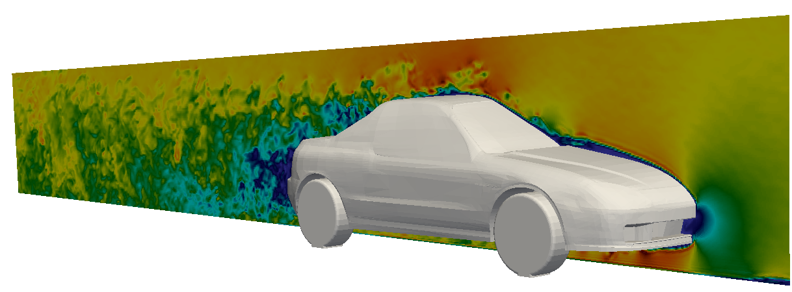
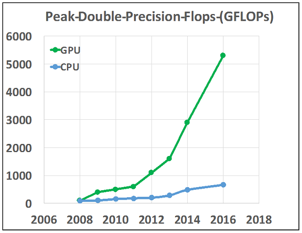
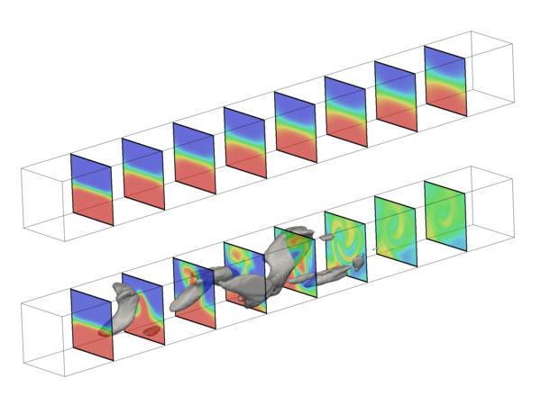

<script src="TCLBmain.js"></script> 

```{js}
$("#mainHeader").removeClass("alwaysShrunk");
$("#pageContent").removeClass("standardPadding");
```
<!--html_preserve-->


<div id="homeContent">
  <div class="band full sparkle first rightText">
    <div class="bandContent vCenter">
      <div class="blurb">
        <div class="tagline">Analyze. Share. Reproduce.</div>
          <div>TCLB is a free, open source, CFD solver, developed at <a href="https://c-cfd.meil.pw.edu.pl/">C-CFD group</a> at <a href="https://www.pw.edu.pl/">Warsaw University of Technology</a>. It has wide range of applicability, including complex fluid flows involving turbulence and heat transfer, electrokinetics, multiphase problems, and non-newtonian fluids.
          </div>
      </div>
    </div>
    
  </div>

  <div class="band full cgblue second leftText">
    <div class="bandContent vCenter">
      <div class="blurb">
        <div>
                Its core is a high-performance.MPI+CUDA code, based on <a href="https://en.wikipedia.org/wiki/Lattice_Boltzmann_methods">Lattice Boltzmann Method</a> . Because of that it can be parallelized efficiently and solved using GPGPUs.
        </div>
      </div>
    </div>
    
  </div>

  <div class="band full lgrey third rightText">
    
    <div class="bandContent vCenter">
      <div class="blurb">
        <div>
                Adjoint capability can also be found in TCLB, and can be used for topology optimization.
        </div>
        <div class="actions">
          <div><a href="../user_installation.html"><button class="bigButton getStarted">Get Started</button></a></div>
          <div><a href="https://github.com/CFD-GO/TCLB/"><button class="bigButton gallery">View on GitHub</button></a></div>
        </div>
      </div>
    </div>
  </div>
</div>

<!--/html_preserve-->