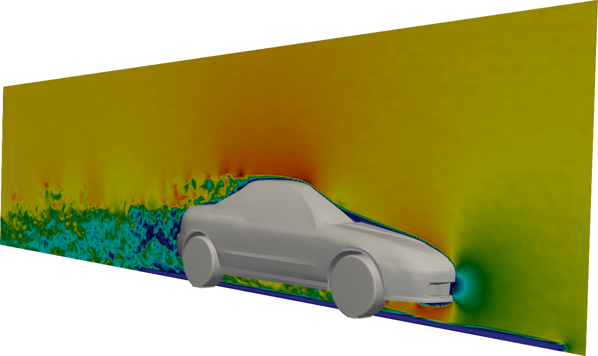

```{js echo=FALSE}
var RMD = {};

(function() {


  RMD.AppViewModel = function() {
    var self = this;

    self.handleWindowScroll = function(event) {
      var scrollPos = $(event.target).scrollTop();
      if (scrollPos > 20) {
        $('.navbar').removeClass("grow");
      }
      else {
        $('.navbar').addClass("grow");
      }
    }
    self.init = function() {
      $('.navbar').addClass("grow");
      $(window).on('scroll', self.handleWindowScroll);
    }
  }


}());

$(document).ready(function() {
  RMD.app = new RMD.AppViewModel();
  RMD.app.init();
});
```

# {.widerow .row1}
## {.col-sm-7}



## Fast. Functional. Fun. {.col-sm-5 .nicecol}

TCLB is a free and open source CFD solver based on <a href="https://en.wikipedia.org/wiki/Lattice_Boltzmann_methods">Lattice Boltzmann Method</a> with a wide range of applicability, including complex fluid flows involving turbulence and heat transfer, electrokinetics, multiphase problems, and non-newtonian fluids.

# {.widerow .row2}
## High performance on GPU {.col-sm-5 .nicecol}

Very good scalability of the TCLB code gives the posibility Its core is a high-performance CUDA code, which can be ran efficiently on multiple GPUs, with performance far beyond usual, CPU-based programs.

## {.col-sm-7}


# {.widerow .row3}
## {.col-sm-7}


## Adjoint optimization {.col-sm-5 .nicecol}

Adjoint capability can also be found in TCLB, and can be used for topology optimization.
